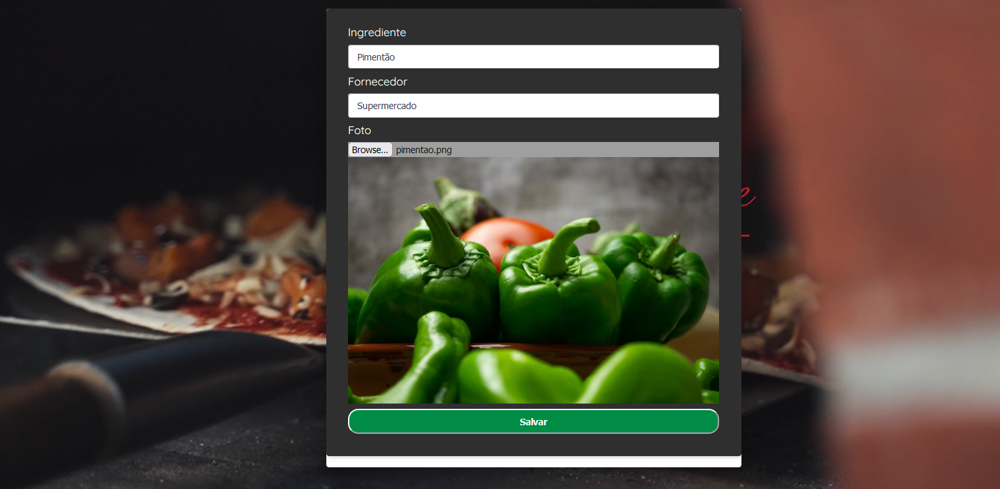

# PizzaRestaurantNEXT
Online pizza ordering written in Nextjs

## Project forked from  https://github.com/Vitals9367/pizza_website

- Added backend to the project
- Added database scripts to the project
- Added API fetch and item listing
- Added Feature to upload ingredients

## Steps to run the project
- npm install
- npm run dev

## Steps to create de database
- docker compose up
- attach shell (in the docker container)
- start mongo instance as replica set   ( mongosh >  rs.initiate()  )
- set DATABASE_url in .env  
- prisma db push
- prisma db seed         ( you may need  > npm install -g tsx )
